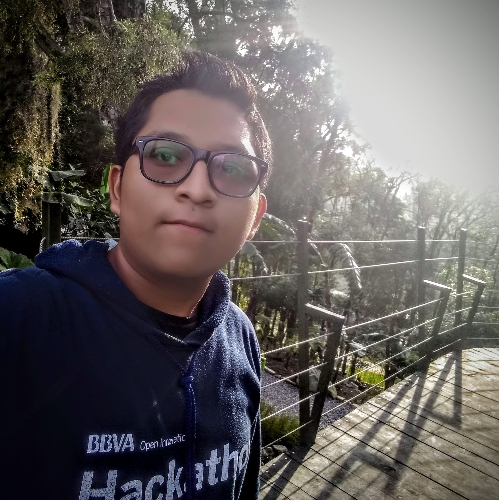

<h1 align="center">Hi There, Welcome to my Github profile!  </h1>

 
 

<h2>About me</h2>
<ul>
  <li>☕Java Developer</li>
  <li>⚡Leader <a href="http://beacons.ai/codigo_bits/" target="_blank">Código bits</a></li>
  <li>🚀Organizer <a href="https://gdg.community.dev/gdg-orizaba-1/" target="_blank">GDG Orizaba</a></li>
  <li>💻<a href="https://studentambassadors.microsoft.com/es-ES/studentambassadors/profile/4f08f343-515f-47a5-b274-f5863b9d70a4" target="_blank">Microsoft Learn Student Ambassador</a></li>
  <li>Ambassador Talent Network</li>
  <li>Mentor & Speaker</li>
</ul>

<h2>Programming Languages and Technologies I know</h2>

 

<h2>Mentor | Hackathones</h2>
<ul>
  <h4>2021</h4>
  <li>HackMX | Tecnológico de Monterrey</li>
  <li>Hackathon AMI | UNESCO</li>
  <li>Hackathon BBVA Open Innovation</li>
  <h4>2022</h4>
  <li>PoliHacks | IPN</li>
  <li>Talent Hackathon | Talent Network</li>
</ul>

<h2>Conferencias</h2>

<h2>My Contributions</h2>

<!-- https://dev.to/mishmanners/how-to-enable-github-actions-on-your-profile-readme-for-a-contribution-graph-4l66 -->

<h2></h2>

